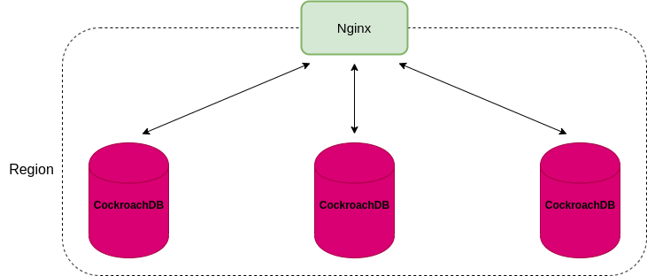

# CockroachDB

## 1. Deployment  

Mô hình deploy benchmark:  

<div align="center">
    
</div>

Đối với mô hình **Single-region**, topology cho deployment như sau:  
- 1 Region
- 3 AZs trong một region
- 3+ nodes accross AZs  
- App và load balancer đặt trong cùng region với VMs  

**Lưu ý**: Chỉ scale một cụm với tối đa 15 nodes

Start mỗi node trên các VMs khác nhau, đặt cờ `--locality` để mô tả vị trí của node region :

```sh
cockroach start \
--locality=region=us-east,zone=east1 \
--certs-dir=certs \
--advertise-addr=<node1 internal address> \
--join=<node1 internal address>:26257,<node2 internal address>:26257,<node3 internal address>:26257 \        
--cache=.25 \
--max-sql-memory=.25 \
--background
```  

## 2. Test environment  

### 2.1 Cấu hình hệ điều hành
|Linux OS platform|Version|
|--|--|
|CentOS Linux|  7.7.1908

### 2.2 Cấu hình server
Component| CPU| Memory| Local Storage| Instance Number
|--|--|--|--|--|
YB-Master|   32 core|    64 GB|  HDD|    3 (10.20.11.56-57-58)
YB-TServer| 32 core|    64 GB|  SSD|    4 (10.20.11.56-54-55)

#### Recommend
|Type|Name
|--|--|
OS|	Linux (CentOS 7.3.1611)
CPU|32vCPUs
RAM|2GB RAM cho mỗi vCPU
DISK|SSD hay NVMe, 300GB - 2TB

#### Lưu ý:
- Để tăng **throughput**, thêm node vào cụm thay vì tăng kích thước node. vCPUs cao sẽ bị NUMA (non-uniform memory access) implication  
- Để tối ưu **khả năng phục hồi**, nên chia nhỏ node để có nhiều node hơn có kích thước nhỏ hơn, giúp quá trình khôi phục node bị fail nhanh hơn.  
- Sử dụng Linux filesytem loại **ext4**  
- Tránh sử dụng shared storage như NFS, CIFS, CEPH  
- Sử dụng **iostat** để monitor IOPS  
- Đặt [ballast file](https://www.cockroachlabs.com/docs/v20.1/cockroach-debug-ballast.html) trong mỗi storage dirctory của mỗi node. Nếu bị hết dung lượng disk ta có thể xóa ballast file  
- Sử dụng local disk không có RAID.  

## 3. Test configuration  

(Sẽ update sau)

## 4. Best practices  

### 4.1 Multi-row DML  
 
Đối với các câu lệnh `INSERT`, `UPSERT`, `DELETE`, một multi-row DML nhanh hơn là nhiều single-row DML.  

Dùng TRUNCATE để delete tất cả rows trong table thay vì dùng DELETE.  

### 4.2 Bulk insert  

Dùng multi-row `INSERT` cho các bulk insert vào bảng, tức là batch nhiều lệnh INSERT row riêng lẻ thành một lệnh INSERT cho nhiều row. Ta phải test nhiều batch size để chọn ra batch size tối ưu nhất.  

```sql
INSERT INTO users (id, city, name, address, credit_card) VALUES
    ('8a3d70a3-d70a-4000-8000-00000000001b', 'seattle', 'Eric', '400 Broad St', '0987654321'),
    ('9eb851eb-851e-4800-8000-00000000001f', 'new york', 'Harry Potter', '214 W 43rd St', '5678901234');
```  

Khi insert nhiều rows hay bulk-insert vào một bảng hoàn toàn mới, lệnh `IMPORT` thực hiện tốt hơn `INSERT`.  

### 4.3 Unique ID  

Có hai cách hiệu quả để sinh unique ID:  
- Sử dụng `multi-column primary keys`. Đảm bảo rằng các field tự tăng đặt **sau** column đầu tiên của primary key.  
- Sử dụng `UUID`  
- Sử dụng `INSERT` kèm với mệnh đề `RETURN` 
  ```sql
  INSERT INTO drivers (id, city)
  VALUES (DEFAULT, 'seattle'), (DEFAULT, 'chicago')
  RETURNING id;
  ```  


### 4.4 Indexs  

Sử dụng secondary indexes để tăng performance khi query cho cột không nằm trong primary key. CockroachDB tự động tạo secondary indexes cho các column có constraint là `UNIQUE`.  

Drop các `indexes không xài tới` vì chúng ảnh hưởng đến tốc độ write.  

Tránh đánh index trên các `sequential keys` vì điều này dẫn đến range hotspots. Thay vào đó, sử dụng `random generated unique IDs` hay multi-column keys. Nếu phải thực hiện index trên sequential keys, sử dụng [hash-shared indexes](https://www.cockroachlabs.com/docs/stable/indexes.html#hash-sharded-indexes).   


### 4.5 Join  

Joins trên [interleaved tables](https://www.cockroachlabs.com/docs/stable/interleave-in-parent.html)  

Outer joins thường kém hiệu quả hơn inner joins. Full outer joins kém hiệu quả nhất.  

Sử dụng `EXPLAIN` cho mỗi join queries để kiểm tra index được sử dụng.  

Sử dụng index cho join nhanh hơn.  

### 4.6 Subquery  

Đưa việc tính toán kết quả cho subquery cho client trước và sử dụng các kết quả trả về cho surrounding query.  

Để phòng tránh cạn memory, đảm bảo các subquery trả về ít kết quả nhất có thể.  

### 4.7 Table scans  

Tránh dùng `SELECT *` cho large table.  

Tránh dùng `SELECT DISTINCT` cho large table.  

Dùng `AS OF SYSTEM TIME` để giảm conflict cho câu query chạy lâu. Bởi vì lệnh này đọc dữ liệu quá khứ nên việc đọc có thể bị stale.  

## References

[Deploy a Test cluster](https://www.cockroachlabs.com/docs/stable/deploy-a-test-cluster.html)  

[Basic production](https://www.cockroachlabs.com/docs/stable/topology-basic-production.html)  

[Production checklist](https://www.cockroachlabs.com/docs/stable/recommended-production-settings.html)  

[SQL Performance Best Practices](https://www.cockroachlabs.com/docs/stable/performance-best-practices-overview.html)  

