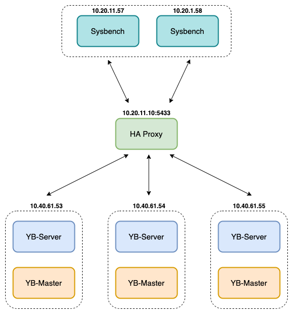

# YugabyteDB

## 1. Deployment  

### 1.1 Deployment
Replication factor (RF) nên là số lẻ để đảm bảo majority consensus khi có sự số xảy ra, tức là chỉ cần `(n+1)/2` node còn sống thì hệ thống vẫn hoạt động đúng. RF mặc định là `3`.
Số lượng YB-Master chạy trên một cụm phải `bằng RF`. Mỗi server chạy trên `1` server.
Số lượng YB-TServer không được nhỏ hơn RF. Mỗi server chạy trên 1 server.

Mô hình deploy benchmark:

<div align="center">
 
</div>


### 1.2 System configuration
Cài ntp, epel-release

```sh
sudo yum install -y epel-release ntp
```

Kiểm tra ulimit

```sh
ulimit -a
```

Settings thích hợp để chạy YugabyteDB

```
core file size          (blocks, -c) unlimited
data seg size           (kbytes, -d) unlimited
scheduling priority             (-e) 0
file size               (blocks, -f) unlimited
pending signals                 (-i) 119934
max locked memory       (kbytes, -l) 64
max memory size         (kbytes, -m) unlimited
open files                      (-n) 1048576
pipe size            (512 bytes, -p) 8
POSIX message queues     (bytes, -q) 819200
real-time priority              (-r) 0
stack size              (kbytes, -s) 8192
cpu time               (seconds, -t) unlimited
max user processes              (-u) 12000
virtual memory          (kbytes, -v) unlimited
file locks                      (-x) unlimited
```

Ta có thể chỉnh config trong file **/etc/security/limits.conf**:

```
*                -       core            unlimited
*                -       data            unlimited
*                -       fsize           unlimited
*                -       sigpending      119934
*                -       memlock         64
*                -       rss             unlimited
*                -       nofile          1048576
*                -       msgqueue        819200
*                -       stack           8192
*                -       cpu             unlimited
*                -       nproc           12000
*                -       locks           unlimited
```

Lưu ý, nếu sử dụng hệ điều hành CentOS, file **/etc/security/limits.d/20-nproc.conf** phải được chỉnh sửa:

```
*          soft    nproc     12000
```

Đối với Ubuntu, thêm setting để thay đổi ulimit cho gui login. Trong file **/etc/systemd/user.conf** và **/etc/systemd/system.conf**, thêm vào cuối mỗi file:

```yaml
DefaultLimitNOFILE=64000
```

## 2. Test environment

### 2.1 Cấu hình hệ điều hành
|Linux OS platform|Version|
|--|--|
|CentOS Linux|  7.7.1908

### 2.2 Cấu hình server
Component| CPU| Memory| Disk type| Instance Number
|--|--|--|--|--|
YB-Master|   32 core|    64 GB|  HDD|    3 (10.20.11.56-57-58)
YB-TServer| 32 core|    64 GB|  SSD|    4 (10.20.11.56-54-55)

## 3. Test configuration
### 3.1 yb-tserver 
Syntax: **yb-tserver [ flags ]**

Type|Default|Description|
--|--|--|
ysql_default_transaction_isolation|  REPEATABLE READ| Valid values: SERIALIZABLE, REPEATABLE READ, READ COMMITTED, and READ UNCOMMITTED. <br> **Chú ý:** YugabyteDB chỉ hỗ trợ hai mức cô lập giao dịch: REPEATABLE READ (aka snapshot) and SERIALIZABLE.
enable_ondisk_compression| true| Enable Snappy compression.
rocksdb_compact_flush_rate_limit_bytes_per_sec| 256MB| Sử dụng để kiểm soát rate of memstore flush và nén file SSTable
rocksdb_universal_compaction_min_merge_width| 4| Compactions run only if there are at least rocksdb_universal_compaction_min_merge_width eligible files and their running total (summation of size of files considered so far) is within rocksdb_universal_compaction_size_ratio of the next file in consideration to be included into the same compaction.
rocksdb_universal_compaction_size_ratio| 20|Compactions run only if there are at least rocksdb_universal_compaction_min_merge_width eligible files and their running total (summation of size of files considered so far) is within rocksdb_universal_compaction_size_ratio of the next file in consideration to be included into the same compaction.
timestamp_history_retention_interval_sec| 120|Khoảng thời gian (đơn vị second) để giữ lại history/older versions dữ liệu. Đặt giá trị này **lớn hơn** thời lượng thực hiện ​​của bất kỳ transaction nào trong ứng dụng.
remote_bootstrap_rate_limit_bytes_per_sec| 256MB|Rate control across all tablets being remote bootstrapped from or to this process.

### 3.2 yb-master
Syntax: **yb-master [ flag  ] | [ flag ]**

Type|Default|Description|
--|--|--|
enable_ysql| true| Enables YSQL API.

## 4. Best practices
### 4.1 Global secondary indexes
Nếu table có sử dụng distributed transaction thì sử dụng **transactions = { 'enabled' : true }**. Ví dụ:
```sql
CREATE TABLE tracking (id int PRIMARY KEY) WITH tablets = 10 AND transactions = { 'enabled' : true };
```
Khi đánh index có thể sử dụng **include column** để store giá trị của column vào index, giúp tăng performance (không cần scan table) khi query có liên quan đến các columns đó. Ví dụ:

```sql
CREATE INDEX orders_by_date ON orders (order_date) INCLUDE (amount);
```

#### 4.2 Unique indexes
Sử dụng nó để đảm bảo tính duy nhất của các giá trị cột index. Ví dụ:

```sql
CREATE UNIQUE INDEX emp_by_userid ON emp (userid);
```

#### 4.3 Atomic read modify write operations with UPDATE IF EXISTS
Operations như **UPDATE ... IF EXISTS, INSERT ... IF NOT EXISTS** được thực hiện atomic.

#### 4.4 JSONB document data type
YugabyteDB có loại dữ liệu jsonb giúp dễ model data mà không cần set schema và có thể thay đổi được. Nó cũng hỗ trợ **JSONB expression indexes** để tăng performance khi scan các entry của json. Ví dụ:

```sql
CREATE TABLE store.books ( id int PRIMARY KEY, details jsonb );
INSERT INTO store.books (id, details) VALUES
  (1, '{ "name": "Macbeth", "author": { "first_name": "William", "last_name": "Shakespeare" }, "year": 1623, "editors": ["John", "Elizabeth", "Jeff"] }');
```

**Chú ý**: sử dụng nó khi cần thiết, vì tốc độ read và write trên column jsonb sẽ chậm hơn column bình thường.

#### 4.5 Expire older records automatically with TTL
Sử dụng TTL feature để automatic expiry cho data, các giá trị cũ có thể bị xoá đi. 

**Chú ý**: TTL không sử dụng trong các transaction table.

#### 4.6 Use YugabyteDB drivers
Sử dụsng các client driver mà YugabyteDB cung cấp.

#### 4.7 Leverage connection pooling in the YCQL client
Single client (say a multi-threaded application) nên sử dụng single cluster object. Nó có thể config được số lượng connection tới yb-tservers.

#### 4.8 Use prepared statements
Sử dụng prepared statements bấy cứ khi nào để giúp cải thiện thông lượng và YB server không cần phải parse câu query.

#### 4.9 Use batching for higher throughput
Sử dụng batching để viết các operations. Điều này sẽ gửi tất cả các operations trong một request RPC thay vì sử dụng nhiều request RPC. Sử dụng batching có latency cao hơn so với các single operation nhưng nó có tổng throught cao hơn. Ví dụ:

```java
// Create a batch statement object.
BatchStatement batch = new BatchStatement();

// Create a prepared statement object to add to the batch.
PreparedStatement insert = client.prepare("INSERT INTO table (k, v) VALUES (?, ?);");

// Bind values to the prepared statement and add them to the batch.
for (...) {
  batch.add(insert.bind( ... <values for bind variables> ... ));
}  

// Execute the batch operation.
ResultSet resultSet = client.execute(batch);

```

#### 4.10 Column and row sizes
Nên giữ giữ các column trong phạm vi 2MB hoặc ít hơn mặc dù YB hỗ trợ một cột riêng lẻ khoảng 32MB và giữ kích thước của các rows trong phạm vi 32 MB hoặc ít hơn.

#### 4.11 Miscellaneous
Sử dụng **Truncate** để empty table thay vì dùng Delete.

## 5. References
https://docs.yugabyte.com/latest/develop/best-practices-ycql/
https://docs.yugabyte.com/latest/reference/configuration/
