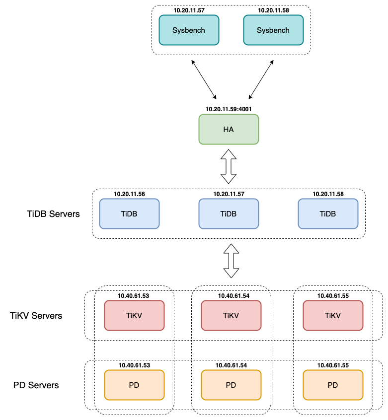

# Sysbench benchmark TiDB

- [Sysbench benchmark TiDB](#sysbench-benchmark-tidb)
- [1. Model deployment](#1-model-deployment)
    - [1.1 OS configuration](#11-os-configuration)
    - [1.2 Hardware configuration](#12-hardware-configuration)
    - [1.3 Versions](#13-versions)
- [2. Test results](#2-test-results)
    - [2.1 oltp_read_only](#21-oltp_read_only)
    - [2.2 oltp_write_only](#22-oltp_write_only)
    - [2.3 oltp_read_write](#23-oltp_read_write)
    - [2.4 oltp_point_select](#24-oltp_point_select)
    - [2.5 oltp_insert](#25-oltp_insert)
    - [2.6 oltp_update_index](#26-oltp_update_index)
    - [2.7 oltp_update_non_index](#27-oltp_update_non_index)
    - [2.8 oltp_delete](#28-oltp_delete)

See detail test plan [here](../plan_test.md)

# 1. Model deployment

    

### 1.1 OS configuration

| **Linux OS platform** | **Version** |
|-----------------------|-------------|
| CentOS Linux          | 7.7.1908    |

### 1.2 Hardware configuration

| **Component**     | **Node**       | **CPU**  | **Mem** | **Disk** |
|-------------------|----------------|----------|---------|----------|
| TiKV              | 10.40.61.53-55  | 32vCPU | 64GB    | SSD      |
| PD                | 10.40.61.53-55  | 32vCPU | 64GB    | SSD      |
| TiDB              | 10.20.11.56-58 | 32vCPU | 64GB    | HDD      |
| HA proxy          | 10.20.11.59    | 8vCPU  | 16GB    |          |
| Instance Sysbench | 10.20.11.57-58 | 32vCPU | 64GB    | HDD      |

### 1.3 Versions

| **Application** | **Version**                               |
|-----------------|-------------------------------------------|
| TiDB            | 3.0.12                                    |
| Sysbench        | 1.0.20 (using bundled LuaJIT 2.1.0-beta2) |

# 2. Test results

### 2.1 oltp_read_only

-   time = **1800s = 30 minutes**

-   report-interval = **10s**

-   number of tables = **1**

-   table size = **30000000**

**a. Read only with range selects**

| **Type**  | **Instance sysbench**     | **Thread** | **TPS** | **QPS** | **avg.latency(ms)** | **.99.latency(ms)** | **max.latency(ms)** | **start_bench**     | **end_bench**       |
|-----------|---------------------------|------------|---------|---------|---------------------|---------------------|---------------------|---------------------|---------------------|
| read_only | 10.20.11.57               | 1\*8       | 35.30   | 564.83  | 226.59              | 434.83              | 798.69              | 23-06-2020 02:35:21 | 23-06-2020 03:05:21 |
| read_only | 10.20.11.57               | 1\*16      | 44.51   | 712.15  | 359.44              | 601.29              | 1295.69             | 23-06-2020 03:05:36 | 23-06-2020 03:35:36 |
| read_only | 10.20.11.57               | 1\*32      | 47.70   | 763.22  | 670.77              | 1109.09             | 3373.98             | 23-06-2020 03:35:51 | 23-06-2020 04:05:52 |
| read_only | 10.20.11.57               | 1\*64      | 47.88   | 766.12  | 1336.33             | 2632.28             | 14854.25            | 23-06-2020 04:06:09 | 23-06-2020 04:36:09 |
| read_only | 10.20.11.57,  10.20.11.58 | 2\*64      | 47.85   | 765.69  | 1806.65             | 4517.90             | 18853.65            | 23-06-2020 08:23:18 | 23-06-2020 08:53:19 |

**b. Read only without range selects (time=1200s=20 minutes)**

| **Type**  | **Instance sysbench**    | **Thread** | **TPS** | **QPS**  | **avg.latency(ms)** | **.99.latency(ms)** | **max.latency(ms)** | **start_bench**     | **end_bench**       |
|-----------|--------------------------|------------|---------|----------|---------------------|---------------------|---------------------|---------------------|---------------------|
| read_only | 10.20.11.57              | 1\*8       | 466.29  | 5595.51  | 17.15               | 23.95               | 86.05               | 23-06-2020 10:19:56 | 23-06-2020 10:39:56 |
| read_only | 10.20.11.57              | 1\*16      | 1057.28 | 12687.33 | 15.13               | 22.69               | 110.89              | 23-06-2020 10:40:11 | 23-06-2020 11:00:11 |
| read_only | 10.20.11.57              | 1\*32      | 2268.22 | 27218.64 | 14.10               | 21.11               | 83.28               | 23-06-2020 11:00:26 | 23-06-2020 11:20:26 |
| read_only | 10.20.11.57              | 1\*64      | 4270.08 | 51240.98 | 14.98               | 23.95               | 327.21              | 23-06-2020 11:20:41 | 23-06-2020 11:40:43 |
| read_only | 10.20.11.57, 10.20.11.58 | 2\*64      | 5934.76 | 71217.18 | 21.575              | 31.95               | 251.19              | 23-06-2020 13:05:34 | 23-06-2020 13:25:34 |

### 2.2 oltp_write_only

-   time = **1800s=30 minutes**

-   report-interval = **10s**

-   number of tables = **1**

-   table size = **30000000**

**a. Write only with update_indexes and update_non_indexes**

| **Type**   | **Instance sysbench**    | **Thread** | **TPS** | **QPS**  | **avg.latency(ms)** | **.99.latency(ms)** | **max.latency(ms)** | **start_bench**     | **end_bench**       |
|------------|--------------------------|------------|---------|----------|---------------------|---------------------|---------------------|---------------------|---------------------|
| write_only | 10.20.11.57              | 1\*8       | 927.97  | 5567.80  | 8.62                | 16.41               | 259.96              | 22-06-2020 22:33:19 | 22-06-2020 23:03:19 |
| write_only | 10.20.11.57              | 1\*16      | 1692.77 | 10156.61 | 9.45                | 81.48               | 1720.78             | 22-06-2020 23:03:34 | 22-06-2020 23:33:34 |
| write_only | 10.20.11.57              | 1\*32      | 2380.29 | 14281.74 | 13.44               | 101.13              | 311.73              | 22-06-2020 23:33:49 | 23-06-2020 00:03:49 |
| write_only | 10.20.11.57              | 1\*64      | 3204.37 | 19226.19 | 19.97               | 104.84              | 4004.93             | 23-06-2020 00:04:04 | 23-06-2020 00:34:04 |
| write_only | 10.20.11.57, 10.20.11.58 | 2\*64      | 4834.77 | 29008.63 | 26.845              | 106.75              | 1438.69             | 23-06-2020 07:37:30 | 23-06-2020 08:07:30 |

**b. Write only with only delete_insert (time=1200s=20 minutes)**

| **Type**   | **Instance sysbench**    | **Thread** | **TPS** | **QPS**  | **avg.latency(ms)** | **.99.latency(ms)** | **max.latency(ms)** | **start_bench**     | **end_bench**       |
|------------|--------------------------|------------|---------|----------|---------------------|---------------------|---------------------|---------------------|---------------------|
| write_only | 10.20.11.57              | 1\*8       | 1073.55 | 4294.21  | 7.45                | 17.32               | 194.99              | 23-06-2020 11:40:58 | 23-06-2020 12:00:58 |
| write_only | 10.20.11.57              | 1\*16      | 1803.83 | 7215.31  | 9.45                | 87.56               | 229.17              | 23-06-2020 12:01:13 | 23-06-2020 12:21:13 |
| write_only | 10.20.11.57              | 1\*32      | 2669.13 | 10676.53 | 11.98               | 99.33               | 217.57              | 23-06-2020 12:21:28 | 23-06-2020 12:41:28 |
| write_only | 10.20.11.57              | 1\*64      | 3649.76 | 14599.03 | 17.53               | 102.97              | 235.88              | 23-06-2020 12:41:43 | 23-06-2020 13:01:43 |
| write_only | 10.20.11.57, 10.20.11.58 | 2\*64      | 5157.2  | 20628.81 | 25.145              | 104.84              | 352.3               | 23-06-2020 13:35:23 | 23-06-2020 13:55:23 |

### 2.3 oltp_read_write

-   time = **1800s=30 minutes**

-   report-interval = **10s**

-   number of tables = **1**

-   table size = **30000000**

| **Type**   | **Instance sysbench**    | **Thread** | **TPS** | **QPS** | **avg.latency(ms)** | **.99.latency(ms)** | **max.latency(ms)** | **start_bench**     | **end_bench**       |
|------------|--------------------------|------------|---------|---------|---------------------|---------------------|---------------------|---------------------|---------------------|
| read_write | 10.20.11.57              | 1\*8       | 23.97   | 479.46  | 333.65              | 2238.47             | 18101.52            | 22-06-2020 15:18:40 | 22-06-2020 16:48:40 |
| read_write | 10.20.11.57              | 1\*16      | 41.28   | 825.59  | 387.56              | 1069.86             | 7624.61             | 22-06-2020 16:29:04 | 22-06-2020 16:59:04 |
| read_write | 10.20.11.57              | 1\*32      | 47.38   | 947.68  | 675.25              | 1089.30             | 3472.15             | 22-06-2020 17:04:33 | 22-06-2020 17:34:33 |
| read_write | 10.20.11.57              | 1\*64      | 47.80   | 955.93  | 1338.81             | 2449.36             | 8969.21             | 22-06-2020 17:38:27 | 22-06-2020 18:08:27 |
| read_write | 10.20.11.57, 10.20.11.58 | 2\*64      | 47.91   | 958.06  | 2974                | 6462.445            | 29225.65            | 22-06-2020 19:48:41 | 22-06-2020 20:18:43 |

### 2.4 oltp_point_select

-   time = **1200s=20 minutes**

-   report-interval = **10s**

-   number of tables = **1**

-   table size = **30000000**

| **Type**     | **Instance sysbench**    | **Thread** | **TPS**  | **QPS**  | **avg.latency(ms)** | **.99.latency(ms)** | **max.latency(ms)** | **start_bench**     | **end_bench**       |
|--------------|--------------------------|------------|----------|----------|---------------------|---------------------|---------------------|---------------------|---------------------|
| point_select | 10.20.11.57              | 1\*8       | 2396.50  | 2396.50  | 3.34                | 5.09                | 122.51              | 04-07-2020 10:57:21 | 04-07-2020 11:17:22 |
| point_select | 10.20.11.57              | 1\*16      | 5108.68  | 5108.68  | 3.13                | 5.09                | 77.29               | 04-07-2020 11:17:37 | 04-07-2020 11:37:37 |
| point_select | 10.20.11.57              | 1\*32      | 10699.69 | 10699.69 | 2.99                | 5.00                | 58.17               | 04-07-2020 11:37:52 | 04-07-2020 11:57:52 |
| point_select | 10.20.11.57              | 1\*64      | 20978.85 | 20978.85 | 3.05                | 5.88                | 55.66               | 04-07-2020 11:58:07 | 04-07-2020 12:18:07 |
| point_select | 10.20.11.57, 10.20.11.58 | 2\*64      | 38804.2  | 38804.2  | 3.295               | 7.30                | 67.5                | 04-07-2020 16:56:09 | 04-07-2020 17:16:09 |

### 2.5 oltp_insert

-   time = **1200s=20 minutes**

-   report-interval = **10s**

-   number of tables = **1**

-   table size = **30000000**

| **Type** | **Instance sysbench**    | **Thread** | **TPS**  | **QPS**  | **avg.latency(ms)** | **.99.latency(ms)** | **max.latency(ms)** | **start_bench**     | **end_bench**       |
|----------|--------------------------|------------|----------|----------|---------------------|---------------------|---------------------|---------------------|---------------------|
| insert   | 10.20.11.57              | 1\*8       | 1263.33  | 1263.33  | 6.33                | 11.04               | 1992.44             | 04-07-2020 18:20:00 | 04-07-2020 18:40:00 |
| insert   | 10.20.11.57              | 1\*16      | 2403.17  | 2403.17  | 6.65                | 12.30               | 221.42              | 04-07-2020 18:40:18 | 04-07-2020 19:00:18 |
| insert   | 10.20.11.57              | 1\*32      | 4480.91  | 4480.91  | 7.14                | 12.75               | 210.04              | 04-07-2020 19:00:34 | 04-07-2020 19:20:34 |
| insert   | 10.20.11.57              | 1\*64      | 8603.72  | 8603.72  | 7.44                | 12.30               | 401.74              | 04-07-2020 19:20:50 | 04-07-2020 19:40:50 |
| insert   | 10.20.11.57, 10.20.11.58 | 2\*64      | 13467.37 | 13467.37 | 9.505               | 15.135              | 1976.14             | 04-07-2020 19:44:24 | 04-07-2020 20:04:24 |

### 2.6 oltp_update_index

-   time = **1200s=20 minutes**

-   report-interval = **10s**

-   number of tables = **1**

-   table size = **30000000**

| **Type**     | **Instance sysbench**    | **Thread** | **TPS**  | **QPS**  | **avg.latency(ms)** | **.99.latency(ms)** | **max.latency(ms)** | **start_bench**     | **end_bench**       |
|--------------|--------------------------|------------|----------|----------|---------------------|---------------------|---------------------|---------------------|---------------------|
| update_index | 10.20.11.57              | 1\*8       | 1121.84  | 1121.84  | 7.13                | 10.84               | 55.22               | 04-07-2020 12:18:22 | 04-07-2020 12:38:22 |
| update_index | 10.20.11.57              | 1\*16      | 2287.32  | 2287.32  | 6.99                | 10.65               | 132.44              | 04-07-2020 12:38:37 | 04-07-2020 12:58:37 |
| update_index | 10.20.11.57              | 1\*32      | 4326.25  | 4326.25  | 7.39                | 11.24               | 116.74              | 04-07-2020 12:58:52 | 04-07-2020 13:18:52 |
| update_index | 10.20.11.57              | 1\*64      | 8330.85  | 8330.85  | 7.68                | 12.08               | 149.87              | 04-07-2020 13:19:07 | 04-07-2020 13:39:07 |
| update_index | 10.20.11.57, 10.20.11.58 | 2\*64      | 14621.71 | 14621.71 | 8.75                | 14.73               | 150.57              | 05-07-2020 22:57:54 | 05-07-2020 23:17:54 |

### 2.7 oltp_update_non_index

-   time = **1200s=20 minutes**

-   report-interval = **10s**

-   number of tables = **1**

-   table size = **30000000**

| **Type**         | **Instance sysbench**    | **Thread** | **TPS**  | **QPS**  | **avg.latency(ms)** | **.99.latency(ms)** | **max.latency(ms)** | **start_bench**     | **end_bench**       |
|------------------|--------------------------|------------|----------|----------|---------------------|---------------------|---------------------|---------------------|---------------------|
| update_non_index | 10.20.11.57              | 1\*8       | 1096.16  | 1096.16  | 7.29                | 10.84               | 70.19               | 04-07-2020 13:39:22 | 04-07-2020 13:59:22 |
| update_non_index | 10.20.11.57              | 1\*16      | 2236.80  | 2236.80  | 7.15                | 10.65               | 66.19               | 04-07-2020 13:59:37 | 04-07-2020 14:19:37 |
| update_non_index | 10.20.11.57              | 1\*32      | 4364.48  | 4364.48  | 7.33                | 11.04               | 63.83               | 04-07-2020 14:19:52 | 04-07-2020 14:39:52 |
| update_non_index | 10.20.11.57              | 1\*64      | 8311.22  | 8311.22  | 7.70                | 11.87               | 70.36               | 04-07-2020 14:40:07 | 04-07-2020 15:00:07 |
| update_non_index | 10.20.11.57, 10.20.11.58 | 2\*64      | 15047.63 | 15047.63 | 8.50                | 14.73               | 110.8               | 05-07-2020 23:18:09 | 05-07-2020 23:38:09 |

### 2.8 oltp_delete

-   time = **1200s=20 minutes**

-   report-interval = **10s**

-   number of tables = **1**

-   table size = **30000000**

| **Type** | **Instance sysbench**    | **Thread** | **TPS**  | **QPS**  | **avg.latency(ms)** | **.99.latency(ms)** | **max.latency(ms)** | **start_bench**     | **end_bench**       |
|----------|--------------------------|------------|----------|----------|---------------------|---------------------|---------------------|---------------------|---------------------|
| delete   | 10.20.11.57              | 1\*8       | 2039.32  | 2039.32  | 3.92                | 8.90                | 76.49               | 04-07-2020 15:00:22 | 04-07-2020 15:20:22 |
| delete   | 10.20.11.57              | 1\*16      | 4203.71  | 4203.71  | 3.80                | 8.74                | 63.81               | 04-07-2020 15:20:37 | 04-07-2020 15:40:37 |
| delete   | 10.20.11.57              | 1\*32      | 9394.00  | 9394.00  | 3.40                | 8.58                | 79.33               | 04-07-2020 15:40:53 | 04-07-2020 16:00:53 |
| delete   | 10.20.11.57              | 1\*64      | 19703.34 | 19703.34 | 3.25                | 8.90                | 109.69              | 04-07-2020 16:01:08 | 04-07-2020 16:21:08 |
| delete   | 10.20.11.57, 10.20.11.58 | 2\*64      | 40454.43 | 40454.43 | 3.16                | 10.27               | 111.495             | 05-07-2020 23:38:24 | 05-07-2020 23:58:24 |
