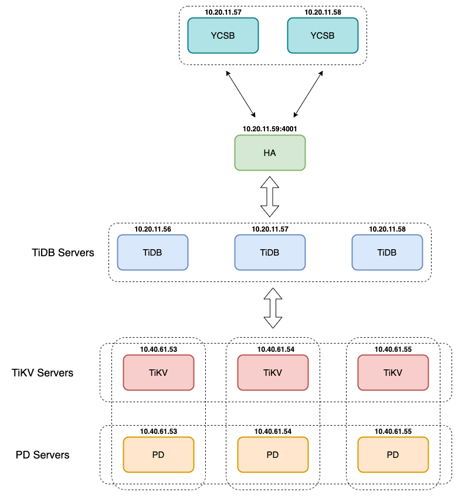

# YCSB-TiDB 6 nodes

- [YCSB-TiDB 6 nodes](#ycsb-tidb-6-nodes)
- [1. Model deployment](#1-model-deployment)
    - [1.1 OS configuration](#11-os-configuration)
    - [1.2 Hardware configuration](#12-hardware-configuration)
    - [1.3 Versions](#13-versions)
- [2. Test results](#2-test-results)
    - [2.1 Workload A](#21-workload-a)
    - [2.2 Workload B](#22-workload-b)
    - [2.3 Workload C](#23-workload-c)
    - [2.4 Workload D](#24-workload-d)
    - [2.5 Workload E](#25-workload-e)
    - [2.6 Workload F](#26-workload-f)

See detail test plan [here](../plan_test.md)

# 1. Model deployment

    

### 1.1 OS configuration

| **Linux OS platform** | **Version** |
|-----------------------|-------------|
| CentOS Linux          | 7.7.1908    |

### 1.2 Hardware configuration

| **Component**     | **Node**       | **CPU**  | **Mem** | **Disk** |
|-------------------|----------------|----------|---------|----------|
| TiKV              | 10.40.61.53-55  | 32vCPU | 64GB    | SSD      |
| PD                | 10.40.61.53-55  | 32vCPU | 64GB    | SSD      |
| TiDB              | 10.20.11.56-58 | 32vCPU | 64GB    | HDD      |
| HA proxy          | 10.20.11.59    | 8vCPU  | 16GB    |          |
| Instance Sysbench | 10.20.11.57-58 | 32vCPU | 64GB    | HDD      |

### 1.3 Versions

| **Application** | **Version** |
|-----------------|-------------|
| TiDB            | 3.0.12      |
| YCSB            | 0.17.0      |

# 2. Test results

### 2.1 Workload A

-   maxexecutiontime = **1200s**

-   **50%** read, **50%** update

| **Instance ycsb**        | **threads** | **avg.latency(ms)**        | **.99.latency(ms)**          | **max.latency(ms)**             | **Throughput**                     | **start_bench**     | **end_bench**       |
|--------------------------|-------------|----------------------------|------------------------------|---------------------------------|------------------------------------|---------------------|---------------------|
| 10.20.11.57              | 1\*8        | 3.43 (read), 7.01 (update) | 6.46 (read), 11.03 (update)  | 196.86 (read), 198.91 (update)  | 764.76 (read),  764.32 (update)    | 05-07-2020 00:18:06 | 05-07-2020 00:38:07 |
| 10.20.11.57              | 1\*16       | 3.33 (read), 7.00 (update) | 7.07 (read), 12.17 (update)  | 203.00 (read), 213.63 (update)  | 1546.14 (read), 1545.32 (update)   | 05-07-2020 00:38:22 | 05-07-2020 00:58:22 |
| 10.20.11.57              | 1\*32       | 3.25 (read), 7.20 (update) | 6.13 (read), 11.52 (update)  | 257.92 (read), 256.13 (update)  | 3056.66 (read), 3058.56 (update)   | 05-07-2020 00:58:37 | 05-07-2020 01:18:37 |
| 10.20.11.57              | 1\*64       | 3.27 (read), 7.80 (update) | 6.95 (read), 13.17 (update)  | 348.67 (read), 494.08 (update)  | 5770.34 (read), 5777.47 (update)   | 05-07-2020 01:18:52 | 05-07-2020 01:38:53 |
| 10.20.11.57, 10.20.11.58 | 2\*64       | 3.8 (read), 8.51 (update)  | 14.4 (read), 19.225 (update) | 227.965(read), 237.825 (update) | 10389.20 (read), 10389.50 (update) | 04-07-2020 22:13:39 | 04-07-2020 22:33:40 |

### 2.2 Workload B

-   maxexecutiontime = **1200s**

-   **95%** read, **5%** update

| **Instance ycsb**        | **threads** | **avg.latency(ms)**        | **.99.latency(ms)**          | **max.latency(ms)**            | **Throughput**                    | **start_bench**     | **end_bench**       |
|--------------------------|-------------|----------------------------|------------------------------|--------------------------------|-----------------------------------|---------------------|---------------------|
| 10.20.11.57              | 1\*8        | 3.37 (read), 7.25 (update) | 6.15 (read), 11.46 (update)  | 143.87 (read), 49.37 (update)  | 2127.71 (read), 111.60 (update)   | 05-07-2020 01:39:08 | 05-07-2020 01:59:08 |
| 10.20.11.57              | 1\*16       | 3.28 (read), 6.90 (update) | 5.36 (read), 10.28 (update)  | 109.82 (read), 63.23 (update)  | 4389.17 (read), 230.96 (update)   | 05-07-2020 01:59:23 | 05-07-2020 02:19:24 |
| 10.20.11.57              | 1\*32       | 3.10 (read), 6.58 (update) | 4.98 (read), 9.57 (update)   | 117.50 (read), 116.35 (update) | 9265.80 (read), 487.13 (update)   | 05-07-2020 02:19:39 | 05-07-2020 02:39:39 |
| 10.20.11.57              | 1\*64       | 3.15 (read), 6.78 (update) | 6.59 (read), 11.17 (update)  | 189.44 (read), 193.92 (update) | 18246.84 (read), 959.00 (update)  | 05-07-2020 02:39:54 | 05-07-2020 02:59:55 |
| 10.20.11.57, 10.20.11.58 | 2\*64       | 3.51 (read), 6.5 (update)  | 10.315 (read), 15.4 (update) | 92.86 (read), 79.01 (update)   | 32727.34 (read), 1724.22 (update) | 04-07-2020 23:01:25 | 04-07-2020 23:21:25 |

### 2.3 Workload C

-   maxexecutiontime = **1200s**

-   **100%** read

| **Instance ycsb**        | **threads** | **avg.latency(ms)** | **.99.latency(ms)** | **max.latency(ms)** | **Throughput** | **start_bench**     | **end_bench**       |
|--------------------------|-------------|---------------------|---------------------|---------------------|----------------|---------------------|---------------------|
| 10.20.11.57              | 1\*8        | 3.50                | 5.64                | 54.24               | 2284.54        | 05-07-2020 03:00:10 | 05-07-2020 03:20:10 |
| 10.20.11.57              | 1\*16       | 3.36                | 5.37                | 62.21               | 4757.07        | 05-07-2020 03:20:25 | 05-07-2020 03:40:25 |
| 10.20.11.57              | 1\*32       | 3.17                | 5.07                | 135.17              | 10092.61       | 05-07-2020 03:40:40 | 05-07-2020 04:00:41 |
| 10.20.11.57              | 1\*64       | 3.16                | 6.80                | 176.13              | 20243.84       | 05-07-2020 04:00:56 | 05-07-2020 04:20:56 |
| 10.20.11.57, 10.20.11.58 | 2\*64       | 3.52                | 9.825               | 87.615              | 36274.58       | 04-07-2020 23:22:48 | 04-07-2020 23:42:48 |

### 2.4 Workload D

-   maxexecutiontime = **1200s**

-   **95%** read, **5%** insert

| **Instance ycsb** | **threads** | **recordcount** | **avg.latency(ms)**        | **.99.latency(ms)**         | **max.latency(ms)**            | **Throughput**                   | **start_bench**     | **end_bench**       |
|-------------------|-------------|-----------------|----------------------------|-----------------------------|--------------------------------|----------------------------------|---------------------|---------------------|
| 10.20.11.57       | 1\*8        | 30000000        | 3.43 (read), 5.92 (insert) | 5.42 (read), 8.58 (insert)  | 129.85 (read), 55.68 (insert)  | 1725.89 (read), 118.54 (insert)  | 05-07-2020 18:01:26 | 05-07-2020 18:21:31 |
| 10.20.11.57       | 1\*16       | 30000000        | 3.39 (read), 5.89 (insert) | 5.64 (read), 8.98 (insert)  | 104.83 (read), 499.83 (insert) | 3601.77 (read), 236.99 (insert)  | 05-07-2020 19:24:05 | 05-07-2020 19:44:10 |
| 10.20.11.57       | 1\*32       | 30000000        | 3.20 (read), 6.07 (insert) | 5.29 (read), 9.32 (insert)  | 546.30 (read), 234.37 (insert) | 7882.77 (read), 492.45 (insert)  | 05-07-2020 20:43:05 | 05-07-2020 21:03:09 |
| 10.20.11.57       | 1\*64       | 30000000        | 3.31 (read), 6.33 (insert) | 6.25 (read), 10.64 (insert) | 257.15 (read), 117.44 (insert) | 15684.26 (read), 944.06 (insert) | 05-07-2020 22:09:48 | 05-07-2020 22:29:52 |
|                   |             |                 |                            |                             |                                |                                  |                     |                     |

### 2.5 Workload E

-   maxexecutiontime = **1200s**

-   **95%** scan, **5%** insert

| **Instance ycsb** | **threads** | **operation count** | **runtime** | **avg.latency(ms)** | **.99.latency(ms)** | **max.latency(ms)** | **start_bench** | **end_bench** |
|-------------------|-------------|---------------------|-------------|---------------------|---------------------|---------------------|-----------------|---------------|

### 2.6 Workload F

-   maxexecutiontime = **1200s**

-   **50%** read, **50%** read-modify-write

| **Instance ycsb**        | **threads** | **avg.latency(ms)**      | **.99.latency(ms)**      | **max.latency(ms)**         | **Throughput**                 | **start_bench**     | **end_bench**       |
|--------------------------|-------------|--------------------------|--------------------------|-----------------------------|--------------------------------|---------------------|---------------------|
| 10.20.11.57              | 1\*8        | 3.23 (read), 10.07 (rmw) | 5.05 (read), 14.16 (rmw) | 53.18 (read), 72.19 (rmw)   | 1192.69 (read), 596.35 (rmv)   | 05-07-2020 04:21:11 | 05-07-2020 04:41:12 |
| 10.20.11.57              | 1\*16       | 3.35 (read), 10.08 (rmw) | 6.05 (read), 15.67 (rmw) | 253.82 (read), 272.89 (rmw) | 2378.95 (read), 1188.91 (rmv)  | 05-07-2020 04:41:27 | 05-07-2020 05:01:27 |
| 10.20.11.57              | 1\*32       | 3.25 (read), 10.22 (rmw) | 5.76 (read), 15.31 (rmw) | 322.20 (read), 330.50 (rmw) | 4745.78 (read), 2372.45 (rmv)  | 05-07-2020 05:01:42 | 05-07-2020 05:21:43 |
| 10.20.11.57              | 1\*64       | 3.46 (read), 11.16 (rmw) | 6.90 (read), 12.61 (rmw) | 216.70 (read), 226.05 (rmw) | 8740.62 (read), 4371.35 (rmv)  | 05-07-2020 05:21:58 | 05-07-2020 05:41:58 |
| 10.20.11.57, 10.20.11.58 | 2\*64       | 3.62 (read), 12.00 (rmw) | 8.40 (read), 14.81 (rmw) | 382.91 (read), 221.44 (rmw) | 16373. 76(read), 8186.89 (rmv) | 05-07-2020 12:13:04 | 05-07-2020 12:33:05 |
