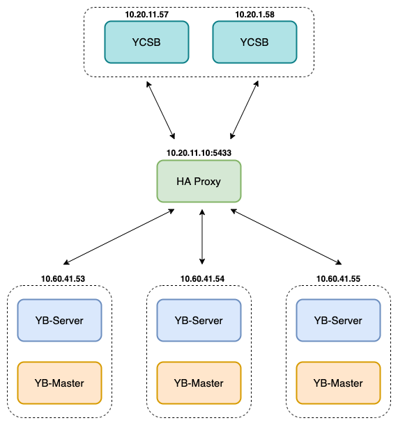

# YCSB - 3 nodes

- [YCSB - 3 nodes](#ycsb---3-nodes)
- [1. Model deployment](#1-model-deployment)
    - [1.1 OS configuration](#11-os-configuration)
    - [1.2 Hardware configuration](#12-hardware-configuration)
    - [1.3 Versions](#13-versions)
- [2. Test results](#2-test-results)
    - [2.1 Workload A](#21-workload-a)
    - [2.2 Workload B](#22-workload-b)
    - [2.3 Workload C](#23-workload-c)
    - [2.4 Workload D](#24-workload-d)
    - [2.5 Workload E](#25-workload-e)
    - [2.6 Workload F](#26-workload-f)
- [3. Issues](#3-issues)

See detail test plan [here](../plan_test.md)

# 1. Model deployment

    

### 1.1 OS configuration

| **Linux OS platform** | **Version** |
|-----------------------|-------------|
| CentOS Linux          | 7.7.1908    |

### 1.2 Hardware configuration

| **Component**     | **Node**       | **CPU**  | **Mem** | **Disk** |
|-------------------|----------------|----------|---------|----------|
| yb-master         | 10.40.61.53-55  | 32 cores | 64GB    | SSD      |
| yb-tserver        | 10.40.61.53-55  | 32 cores | 64GB    | SSD      |
| HA Proxy          | 10.20.11.10    |          |         |          |
| Instance Sysbench | 10.20.11.57-58 | 64 cores | 64GB    | HDD      |

### 1.3 Versions

| **Application** | **Version** |
|-----------------|-------------|
| YugabyteDB      | 2.1.6.0     |
| YCSB            | 0.17.0      |

# 2. Test results

### 2.1 Workload A

-   maxexecutiontime = **1200s**

-   **50%** read, **50%** update

| **Instance ycsb**        | **threads** | **avg.latency(ms)**        | **.99.latency(ms)**          | **max.latency(ms)**            | **Throughput**                      | **start_bench**                         | **end_bench**                           |
|--------------------------|-------------|----------------------------|------------------------------|--------------------------------|-------------------------------------|-----------------------------------------|-----------------------------------------|
| 10.20.11.57              | 1\*8        | 3.46 (read), 4.47 (update) | 13.50 (read), 16.8 (update)  | 234.88 (read), 409.60 (update) | 1006.90 (read), 1006.60 (update)    | 01-07-2020 23:45:06                     | 02-07-2020 00:05:06                     |
| 10.20.11.57              | 1\*16       | 2.84 (read), 3.36 (update) | 8.77 (read), 10.68 (update)  | 334.33 (read), 408.57 (update) | 2574.42 (read), 2576.68 (update)    | 02-07-2020 00:05:21                     | 02-07-2020 00:25:22                     |
| 10.20.11.57              | 1\*32       | 1.59 (read), 3.03 (update) | 4.68 (read), 5.10 (update)   | 249.08 (read), 242.81 (update) | 5635.08 (read), 5636.315 (update)   | 02-07-2020 00:25:37                     | 02-07-2020 00:45:37                     |
| 10.20.11.57              | 1\*64       | 2.67 (read), 3.09 (update) | 5.32 (read), 5.71 (update)   | 379.40 (read), 375.80 (update) | 11018.91 (read),  11021.92 (update) | 02-07-2020 00:45:52                     | 02-07-2020 01:05:52                     |
| 10.20.11.57, 10.20.11.58 | 2\*64       | 4.04 (read), 4.67 (update) | 36.78 (read), 37.29 (update) | 744.19 (read), 760.03 (update) | 14656.32 (read), 14659.38 (update)  | 01-07-2020 23:01:07 01-07-2020 23:01:07 | 01-07-2020 23:21:07 01-07-2020 23:21:07 |

### 2.2 Workload B

-   maxexecutiontime = **1200s**

-   **95%** read, **5%** update

| **Instance ycsb**        | **threads** | **avg.latency(ms)**        | **.99.latency(ms)**        | **max.latency(ms)**            | **Throughput**                    | **start_bench**                          | **end_bench**                            |
|--------------------------|-------------|----------------------------|----------------------------|--------------------------------|-----------------------------------|------------------------------------------|------------------------------------------|
| 10.20.11.57              | 1\*8        | 2.57 (read), 3.32 (update) | 4.09 (read), 4.96 (update) | 195.45 (read), 25.24 (update)  | 2905.27 (read), 153.00 (update)   | 02-07-2020 01:06:08                      | 02-07-2020 01:26:08                      |
| 10.20.11.57              | 1\*16       | 2.89 (read), 3.54 (update) | 4.65 (read), 5.41 (update) | 207.10 (read), 39.45 (update)  | 5177.27 (read), 272.27 (update)   | 02-07-2020 01:26:23                      | 02-07-2020 01:46:23                      |
| 10.20.11.57              | 1\*32       | 2.79 (read), 3.29 (update) | 4.59 (read), 5.11 (update) | 413.95 (read), 415.23 (update) | 10775.59 (read), 567.83 (update)  | 02-07-2020 01:46:38                      | 02-07-2020 02:06:39                      |
| 10.20.11.57              | 1\*64       | 2.70 (read), 2.22 (update) | 6.05 (read), 6.62 (update) | 387.32 (read), 370.17 (update) | 23738.93 (read), 1249.45 (update) | 02-07-2020 02:06:54                      | 02-07-2020 02:26:54                      |
| 10.20.11.57, 10.20.11.58 | 2\*64       | 2.41 (read), 2.98 (update) | 4.97 (read), 5.58 (update) | 707.58 (read), 580.99 (update) | 47499.54 (read), 2500.42 (update) | 01-07-2020 19:38:03, 01-07-2020 19:38:03 | 01-07-2020 19:57:44, 01-07-2020 19:58:19 |

### 2.3 Workload C

-   maxexecutiontime = **1200s**

-   **100%** read

| **Instance ycsb**        | **threads** | **avg.latency(ms)** | **.99.latency(ms)** | **max.latency(ms)** | **Throughput** | **start_bench**     | **end_bench**       |
|--------------------------|-------------|---------------------|---------------------|---------------------|----------------|---------------------|---------------------|
| 10.20.11.57              | 1\*8        | 2.82                | 4.34                | 181.50              | 2830.00        | 02-07-2020 02:27:09 | 02-07-2020 02:47:10 |
| 10.20.11.57              | 1\*16       | 2.33                | 3.82                | 197.63              | 6864.21        | 02-07-2020 02:47:25 | 02-07-2020 03:07:25 |
| 10.20.11.57              | 1\*32       | 2.08                | 4.06                | 2.53                | 15327.35       | 02-07-2020 03:07:40 | 02-07-2020 03:27:41 |
| 10.20.11.57              | 1\*64       | 2.25                | 3.80                | 3.91                | 26714.32       | 02-07-2020 03:27:56 | 02-07-2020 03:46:39 |
| 10.20.11.57, 10.20.11.58 | 2\*64       | 2.34                | 6.77                | 718.84              | 45694.59       | 01-07-2020 18:24:44 | 01-07-2020 18:46:38 |

### 2.4 Workload D

-   maxexecutiontime = **1200s**

-   **95%** read, **5%** insert

| **Instance ycsb** | **threads** | **recordcount** | **avg.latency(ms)**        | **.99.latency(ms)**        | **max.latency(ms)**              | **Throughput**                    | **start_bench**     | **end_bench**       |
|-------------------|-------------|-----------------|----------------------------|----------------------------|----------------------------------|-----------------------------------|---------------------|---------------------|
| 10.20.11.57       | 1\*8        | 30000000        | 2.50 (read), 3.28 (insert) | 3.99 (read), 4.89 (insert) | 193.79 (read), 69.76 (insert)    | 2982.34 (read), 156.57 (insert)   | 02-07-2020 05:07:56 | 02-07-2020 05:27:56 |
| 10.20.11.57       | 1\*16       | 30000000        | 2.26 (read), 3,03 (insert) | 3.98 (read), 4.86 (insert) | 1624.06 (read), 1190.91 (insert) | 5344.60 (read),  534.37 (insert)  | 02-07-2020 08:47:17 | 02-07-2020 09:07:21 |
| 10.20.11.57       | 1\*32       | 30000000        | 2.46 (read), 3.15 (insert) | 4.16 (read), 4.95 (insert) | 378.88 (read), 380.41 (insert)   | 10129.12 (read), 649.05 (insert)  | 02-07-2020 10:03:19 | 02-07-2020 10:23:23 |
| 10.20.11.57       | 1\*64       | 30000000        | 1.98 (read), 2.63 (insert) | 4.04 (read), 4.90 (insert) | 228.35 (read), 79.74 (insert)    | 20597.66 (read), 1250.54 (insert) | 02-07-2020 11:29:49 | 02-07-2020 11:46:21 |
|                   |             |                 |                            |                            |                                  |                                   |                     |                     |

### 2.5 Workload E

-   maxexecutiontime = **1200s**

-   **95%** scan, **5%** insert

| **Instance ycsb** | **threads** | **operation count** | **runtime** | **avg.latency(ms)** | **.99.latency(ms)** | **max.latency(ms)** | **start_bench** | **end_bench** |
|-------------------|-------------|---------------------|-------------|---------------------|---------------------|---------------------|-----------------|---------------|

### 2.6 Workload F

-   maxexecutiontime = **1200s**

-   **50%** read, **50%** read-modify-write

| **Instance ycsb**        | **threads** | **avg.latency(ms)**     | **.99.latency(ms)**       | **max.latency(ms)**         | **Throughput**                  | **start_bench**                         | **end_bench**                           |
|--------------------------|-------------|-------------------------|---------------------------|-----------------------------|---------------------------------|-----------------------------------------|-----------------------------------------|
| 10.20.11.57              | 1\*8        | 2.27 (read), 4.93 (rmw) | 3.75 (read), 7.81 (rmw)   | 531.96 (read), 538.11 (rmw) | 2230.38 (read), 1116.20 (rmw)   | 02-07-2020 03:46:54                     | 02-07-2020 04:06:54                     |
| 10.20.11.57              | 1\*16       | 2.21 (read), 4.80 (rmw) | 3.58 (read), 7.36 (rmw)   | 573.95 (read), 578.04 (rmw) | 4556.65 (read), 2279.51 (rmw)   | 02-07-2020 04:07:09                     | 02-07-2020 04:27:10                     |
| 10.20.11.57              | 1\*32       | 2.17 (read), 4.67 (rmw) | 3.72 (read), 7.45 (rmw)   | 588.79 (read), 596.48 (rmw) | 9342.59 (read), 4669.50 (rmw)   | 02-07-2020 04:27:25                     | 02-07-2020 04:47:25                     |
| 10.20.11.57              | 1\*64       | 2.22 (read), 4.76 (rmw) | 4.64 (read), 8.79 (rmw)   | 595.45 (read), 599.03 (rmw) | 18303.46 (read), 9150.24 (rmw)  | 02-07-2020 04:47:40                     | 02-07-2020 05:07:41                     |
| 10.20.11.57, 10.20.11.58 | 2\*64       | 2.89 (read), 6.39 (rmw) | 20.44 (read), 40.15 (rmw) | 730.36 (read), 801.01 (rmw) | 50000.00 (read), 24996.18 (rmw) | 01-07-2020 21:14:48 01-07-2020 21:14:48 | 01-07-2020 21:56:59 01-07-2020 21:56:36 |

# 3. Issues

- During the tests we encountered some issues as follows: Already present: Multiple homogeneous errors: [Already present (yb/consensus/retryable_requests.cc:239): https://github.com/yugabyte/yugabyte-db/issues/4853
- Workload D and Duplicate Key Errors: https://github.com/brianfrankcooper/YCSB/issues/762
- Workload D:  Because the workloadD needs to be passed with the value of recordcount to know how many records are currently in the database. Therefore, it can generate an id that is not duplicate within the corresponding  range of recordcount. However, we perform benchmark on 2 servers (2 * 64 threads), each server has the same recordcount and it must parallelly run the workload. Therefore, there is a problem with duplicate-key insert. Currently, each time the workload D finished for each case, we must re-insert the data to ensure the record is always consistent and avoid duplicate-key inserts when running the workload.
- Workload E:  YugabyteDB read-range is very bad, resulting in an extremely long and unbreakable workload even though the benchmark time exceeded maxexecutiontime value.
