# Benchmark Database Tool Sysbench
- [Benchmark Database Tool Sysbench](#benchmark-database-tool-sysbench)
  - [TPC-C](#tpc-c)
    - [1. Overview](#1-overview)
    - [2. Logical database design](#2-logical-database-design)
      - [2.1 Business and Application Environment](#21-business-and-application-environment)
      - [2.2 Database Entities, Relationships, and Characteristics](#22-database-entities-relationships-and-characteristics)
      - [2.3 Table Layouts](#23-table-layouts)
    - [3. Using](#3-using)
      - [3.1 Compile source code](#31-compile-source-code)
      - [3.2 Prepare config](#32-prepare-config)
      - [3.3 Prepare data](#33-prepare-data)
      - [3.4 Run benchmark](#34-run-benchmark)
      - [3.5 Scale the benchmark configuration.](#35-scale-the-benchmark-configuration)
      - [3.6 Result report](#36-result-report)
    - [4. References](#4-references)

## TPC-C
### 1. Overview
- TPC-C is an **online transaction processing** (OLTP) benchmark. It tests the OLTP system by using a commodity sales model that involves the following five transactions of different types:
  - NewOrder: transaction consists of enter-ing a complete order through a single database transaction.
  - Payment: transaction enters a customer’s payment.
  - OrderStatus: transaction queries the status of a customer’s last order.
  - Delivery: transaction processes a batch of ten new, not-yet-delivered orders.
  - StockLevel: transactions determines the number of recently sold items that have a stock-level below a specified threshold.
- When a terminal (end-user) sends the transaction request it waits to receive the results in all cases, except for the Delivery transaction, that simulates a transaction ex-ecuted in deferred mode.
- The performance metric reported by TPC-C is a **business throughput** measuring the number of orders processed per minute.
- The performance metric for this benchmark is expressed in **transactions-per-minute-C (tpmC)**.

### 2. Logical database design
#### 2.1 Business and Application Environment
- The Company by the benchmark is a wholesale supplier with a number of distributed sales **districts** and **warehouses**. 
- Each regional warehouse covers **10 districts**. Each district serves **3,000 customers**. All warehouses maintain stocks for the **100,000 items sold** by the Company. The following diagram for the warehouse, district, and customer:

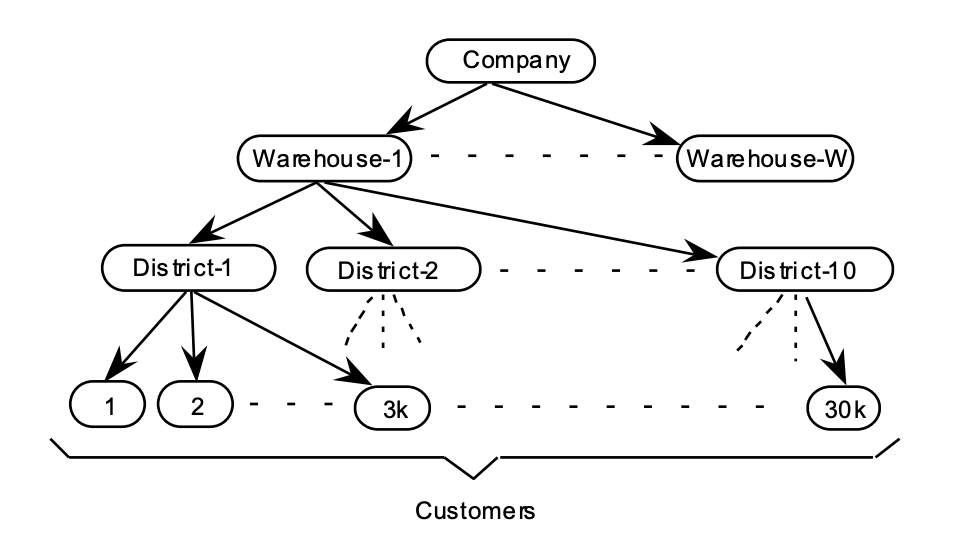

- Customers call the Company to place a new order or request the status of an existing order. Orders are composed of an average of 10 order lines (i.e., line items). One percent of all order lines are for items not in stock at the regional warehouse and must be supplied by another warehouse.
- The Company's system is also used to enter payments from customers, process orders for delivery, and check
stock levels to identify potential supply shortages.

#### 2.2 Database Entities, Relationships, and Characteristics
- The components of the TPC-C database are defined to consist of **nine tables**. 

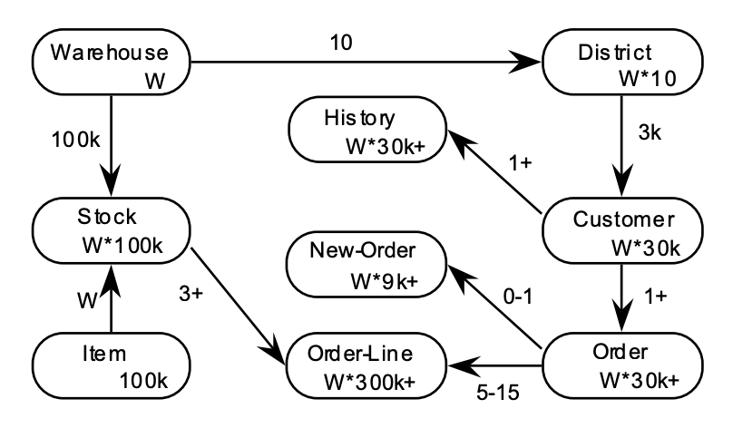

- Legend:
  - The numbers in the entity blocks represent the cardinality of the tables (number of rows).
  - The numbers next to the relationship arrows represent the cardinality of the relationships (average number of children per parent).
  - The plus (+) symbol is used after the cardinality of a relationship or table to illustrate that this number is subject to small variations in the initial database population over the measurement interval as rows are added or deleted.

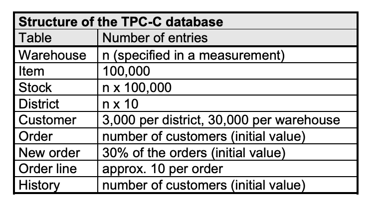

#### 2.3 Table Layouts
- The following list defines the minimal structure:
  - **N unique IDs**:  the attribute hold any one ID within a minimum set of N unique ID(e.g., binary, packed decimal, alphabetic, etc.).
  - **variable text, size N**: the attribute hold any string of characters of a variable length with a maximum length of N.
  - **fixed text, size N**: the attribute hold any string of characters of a fixed length of N.
  - **date and time**: represents the data type for a date value that includes a time component (between 1st January 1900 and 31st December 2100). 
  - **numeric(m [,n])**: unsigned numeric value with at least **m** total decimal digits, of which **n** digits are to the right (after) the decimal point.
  - **signed numeric(m [,n])**: is identical to numeric(m [,n]) except that it can represent both positive and negative values.
  - **null**: means out of the range of valid values for a given attribute and always the same value for that attribute.

- There are tables:

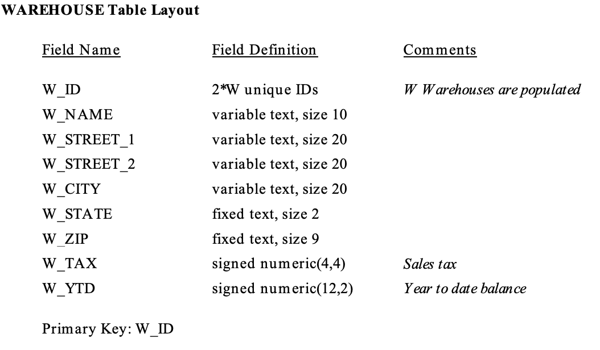

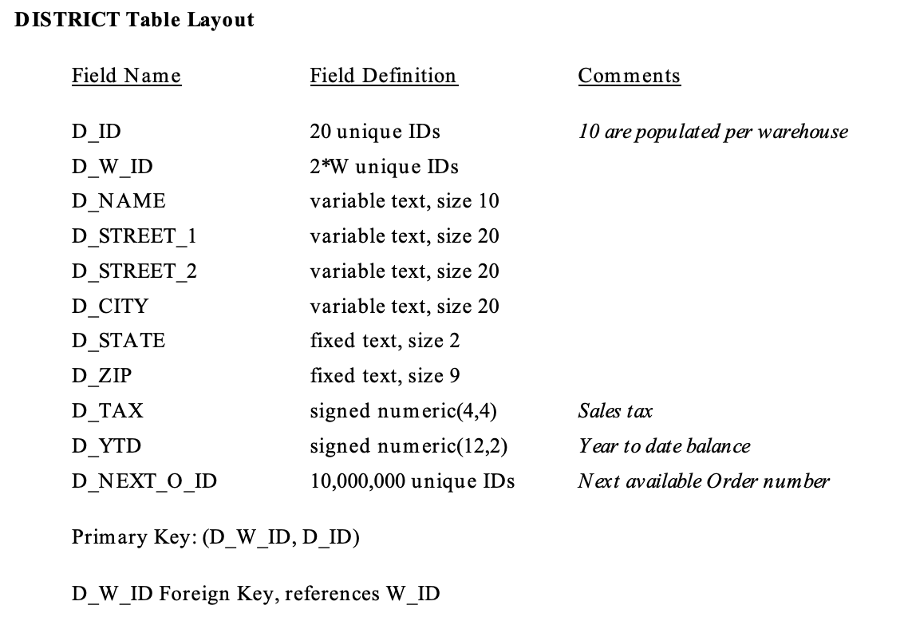

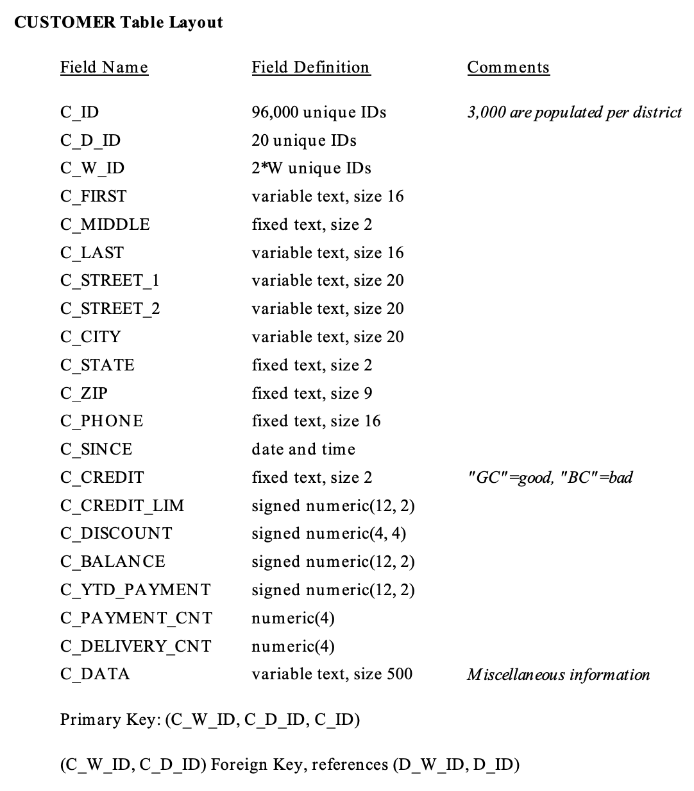

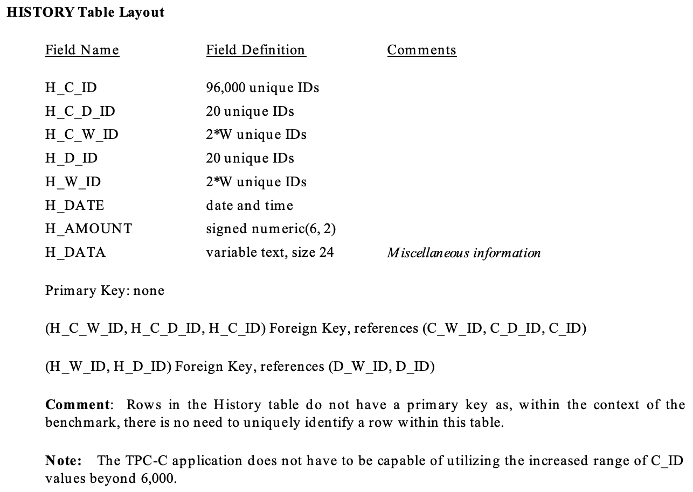

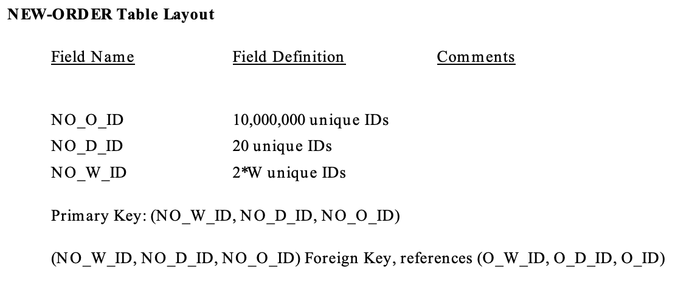

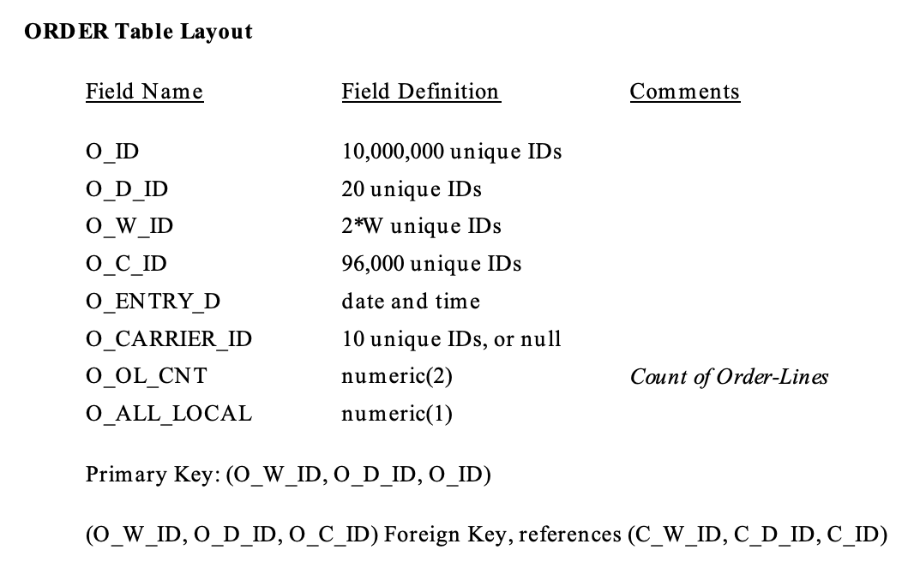

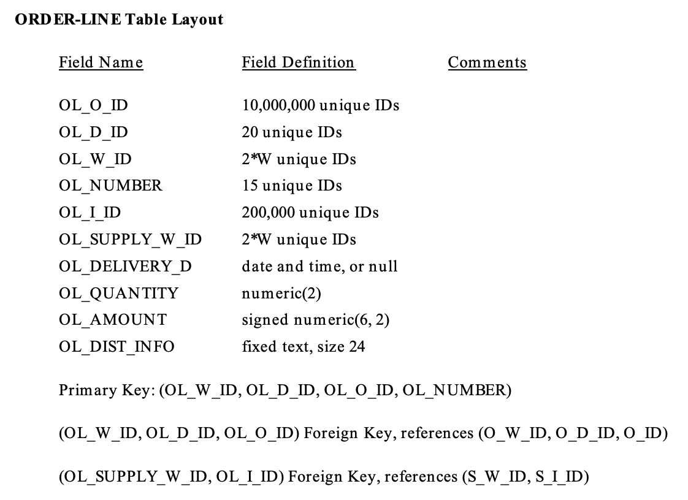

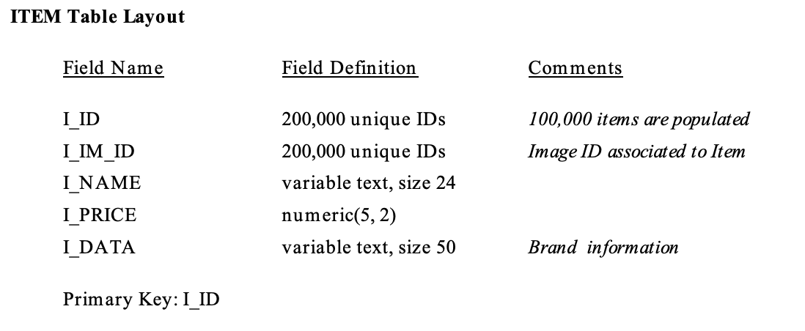

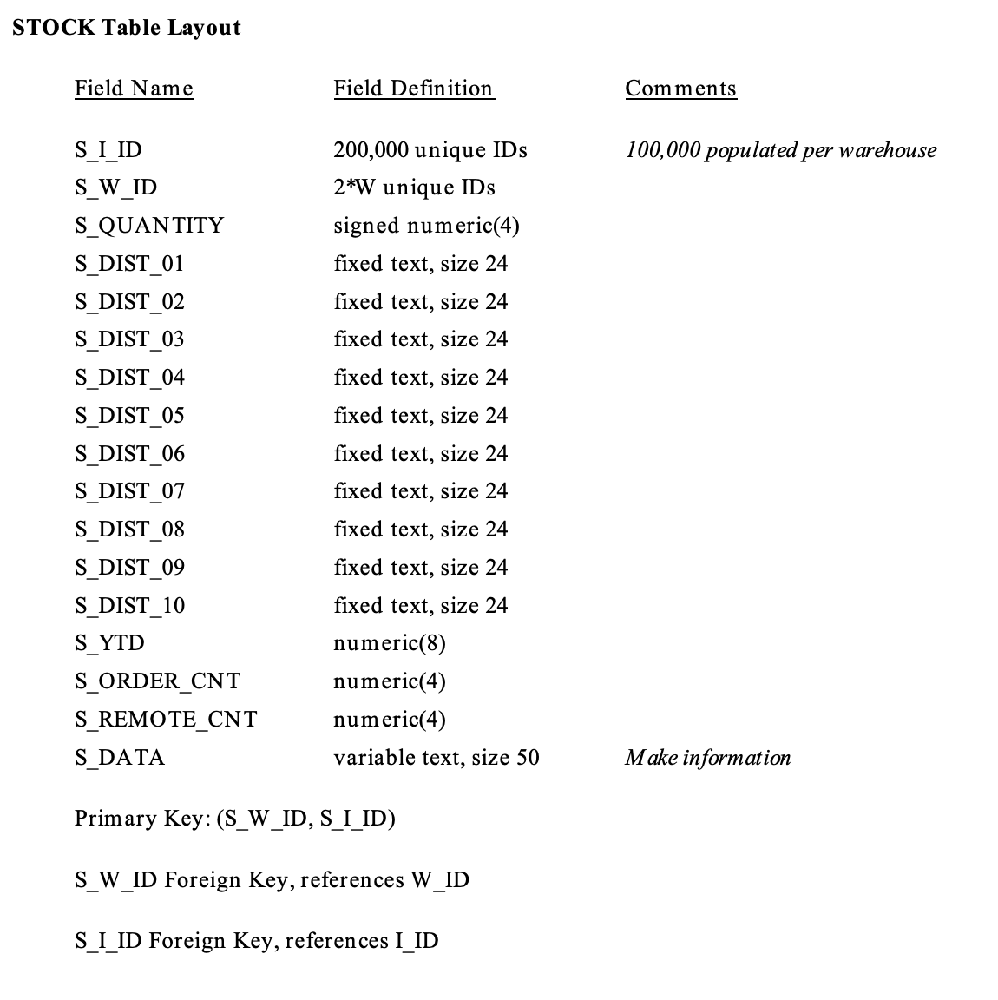

### 3. Using 
- This section will describe usage TPC-C based on source TiDB.
- It is implemented by Java, we can customize it.

#### 3.1 Compile source code
- Install Java and Ant on MacOS:
```sh
$ brew install java8
$ brew install ant
```

- Build: 
```sh
$ cd ./benchmark
$ ant
```

#### 3.2 Prepare config
- For **MySQL** edit the file ./benchmark/run/props.mysql.

Example: 
```sh
db=mysql
driver=com.mysql.jdbc.Driver
conn=jdbc:mysql://localhost:4000/tpcc?useSSL=false&useServerPrepStmts=true&useConfigs=maxPerformance&sessionVariables=tidb_batch_commit=1
user=benchmark
password=pw
```

- For **PostgreSQL** edit the file ./benchmark/run/props.pg.

Example: 
```sh
db=postgres
driver=org.postgresql.Driver
conn=jdbc:postgresql://localhost:5432/postgres
user=benchmark
password=pw
```

#### 3.3 Prepare data
- Before testing, TPC-C Benchmark specifies the initial state of the database, which is the rule for data generation in the database. The ITEM table contains a fixed number of 100,000 items, while the number of warehouses can be adjusted. If there are W records in the WAREHOUSE table, then:
  - **STOCK** table has: **W * 100,000 records** (Each warehouse corresponds to the stock data of 100,000 items)
  - **DISTRICT** table has **W * 10 records** (Each warehouse provides services to 10 districts)
  - **CUSTOMER** table has **W * 10 * 3,000 records** (Each district has 3,000 customers)
  - **HISTORY** table has **W * 10 * 3,000 records** (Each customer has one transaction history)
  - **ORDER** table has **W * 10 * 3,000 records** (Each district has 3,000 orders and the last 900 orders generated are added to the NEW-ORDER table. Each order randomly generates 5 ~ 15 ORDER-LINE records.
- In this document, the testing uses 1,000 warehouses as an example to test TiDB. In file config, we can change the number of warehouses: **warehouses=n**

For MySQL (the same PostgreSQL):
- Use a **mysql-client** to connect to the MySQL server and run the following command:

```sql
$ > create database tpcc;
```

- Build the schema and initial database load:

**MySQL**:
```sh
$ cd ./benchmark/run
$ ./runDatabaseBuild.sh props.mysql
```

**PostgreSQL**:
```sh
$ cd ./benchmark/run
$ ./runDatabaseBuild.sh props.pg
```

Note: This process might last for **several hours** depending on the machine configuration.

Can use [Lingtning](https://pingcap.com/docs/dev/benchmark/benchmark-tidb-using-tpcc/#use-tidb-lightning-to-load-data) to loaddata.

#### 3.4 Run benchmark
- Run the following BenchmarkSQL test script.

**MySQL**
```sh
$ cd ./benchmark/run
$ nohup ./runBenchmark.sh props.mysql &> test_benchmark.log
```

**PostgreSQL**
```sh
$ cd ./benchmark/run
$ nohup ./runBenchmark.sh props.pg &> test_benchmark.log
```

- After the execution is finished, view the result using test.log:

```log
07:09:53,455 [Thread-351] INFO   jTPCC : Term-00, Measured tpmC (NewOrders) = 77373.25
07:09:53,455 [Thread-351] INFO   jTPCC : Term-00, Measured tpmTOTAL = 171959.88
07:09:53,455 [Thread-351] INFO   jTPCC : Term-00, Session Start     = 2019-03-21 07:07:52
07:09:53,456 [Thread-351] INFO   jTPCC : Term-00, Session End       = 2019-03-21 07:09:53
07:09:53,456 [Thread-351] INFO   jTPCC : Term-00, Transaction Count = 345240
```

- Run script run sql.common/test.sql to validate the correctness of the data.

**MySQL**
```sh
$ cd ./benchmark/run
$ ./runSQL.sh props.mysql sql.mysql/test.sql
```

**PostgreSQL**
```sh
$ cd ./benchmark/run
$ ./runSQL.sh props.pg sql.common/test.sql
```

#### 3.5 Scale the benchmark configuration.
- Change the **props.mysql/props.pg** file to the correct scaling (number of warehouses and concurrent connections/terminals). Switch from using a transaction count to time based:
```sh
runTxnsPerTerminal=0
runMins=180
```

- Rebuild the database (if needed) by running:

**MySQL**
```sh
$ cd ./benchmark/run
$ ./runDatabaseDestroy.sh props.mysql
$ ./runDatabaseBuild.sh props.mysql
```

**PostgreSQL**
```sh
$ cd ./benchmark/run
$ ./runDatabaseDestroy.sh props.pg
$ ./runDatabaseBuild.sh props.pg
```

- Then run the benchmark again.

#### 3.6 Result report
- BenchmarkSQL collects detailed performance statistics and (if configured) OS performance data. The example configuration file defaults to a directory starting with **my_result_**. 
- Edit directory contain result in  **props.mysql/props.pg** file: **resultDirectory=my_result_%tY-%tm-%td_%tH%tM%tS**.
- Use the generateReport.sh DIRECTORY script to create an HTML file with graphs. This requires R to be installed.
### 4. References
- http://www.tpc.org/tpc_documents_current_versions/pdf/tpc-c_v5.11.0.pdf
- https://pingcap.com/docs/dev/benchmark/benchmark-tidb-using-tpcc/
- https://sp.ts.fujitsu.com/dmsp/publications/public/benchmark_overview_tpc-c.pdf
- https://github.com/pingcap/benchmarksql