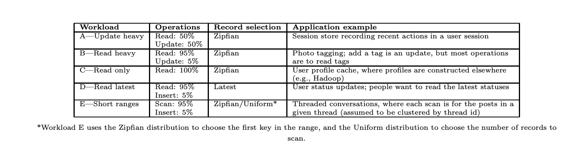
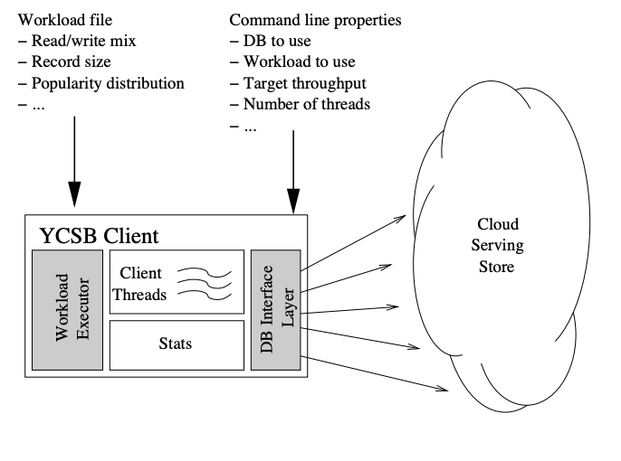

# Benchmark Database Tool YCSB

- [Benchmark Database Tool YCSB](#benchmark-database-tool-ycsb)
  - [YCSB](#ycsb)
    - [1. Overview](#1-overview)
    - [2. Workload](#2-workload)
    - [3. YCSB Client](#3-ycsb-client)
    - [4. Install](#4-install)
      - [**4.1 Custom table properties**](#41-custom-table-properties)
      - [**4.2 Custom sql command**](#42-custom-sql-command)
    - [5. Using](#5-using)
      - [5.1 Properties file](#51-properties-file)
      - [5.2 Config workload file](#52-config-workload-file)
      - [5.3 Execute workload](#53-execute-workload)
      - [5.4 Run script on client](#54-run-script-on-client)
        - [5.4.1 Load command:](#541-load-command)
        - [5.4.2 Run commnad:](#542-run-commnad)
        - [5.4.3 Run on client:](#543-run-on-client)
        - [5.4.4 Benchmark continuously](#544-benchmark-continuously)
## YCSB
### 1. Overview
- YCSB - Yahoo! Cloud Serving Benchmark, it is a framework that helps benchmark key-value and cloud storage serving stores. YCSB gathers test cases into different **workloads** to create diverse test scenarios. There are two components:
  - **YCSB Client**: generate and push data to the workloads, allowing extended workload scripts.
  - **Core workloads**: collection of workloads with test scripts to run tests with data generated with the YCSB Client above.
- We can define additional workloads for each database type or simulate the application's problems. YCSB only provides interfaces to work with databases, if you want to run workloads, you must write code for those interfaces. YCSB has interface code for some databases and you can implement a new database based on interface. Can see detail [here](https://github.com/brianfrankcooper/YCSB/wiki/Getting-Started).

- YCSB focuses on testing the serving capability of the system, which means providing **read / write data**.
- The unit of measurement of YCSB is **operation per second (OPS)**, it does **not care about the transactional** of database.

### 2. Workload
- YCSB includes workloads with a mixture of read and write tests, data size and request distribution.
- The workloads include 1 table with F field, each record of the table includes 1 primary key (YSCB_KEY) of type string and each field named field0, filed1,.... Each filed will have 1 ASCII value with length is L. Example:
  - Initialize each record with F = 10 fields, each field has the value L = 100bytes.
- There are operations:
  - **Insert**: insert a new record.
  - **Update**: update a record by overwriting the value of a field.
  - **Read**: can read random a record or all.
  - **Scan**: scan records in sequence, starting from a primary key random, the number of records to scan is random.
- Distributed method: The client has many ways to randomize the insert / update / read / scan operations
  - **Uniform**: choose a random record, all records in the database can be selected the same.
  - **Zipfian**: choose record based on Zipfian distribution. For example, some records will be selected more because they are head of the distribution while others will be less tail selected.
  - **Latest**: like Zipfian distribution, except for newly inserted records will be made **head of the distribution**.
  - **Multinomial**: predefined percentage. For example, we can assign 95% to Read and 0.05 to Update, 0 to Scan.
- The workload is available in the core workload with the default configuration as follows ([details of workloads](https://github.com/brianfrankcooper/YCSB/wiki/Core-Workloads)):

<div align="center">
    
</div>

- We can create a new workload in one of the ways following [the instructions here](https://github.com/brianfrankcooper/YCSB/wiki/Implementing-New-Workloads).

### 3. YCSB Client
- Model:

<div align="center">
    
</div>

- YCSB client is written in **Java**. It provides an interface to extend workloads and configurable properties to run the workload.

### 4. Install

Download the latest release of YCSB, this is the YCSB for benchmakring:  

```sh
curl -O --location https://github.com/brianfrankcooper/YCSB/releases/download/0.17.0/ycsb-0.17.0.tar.gz
tar xfvz ycsb-0.17.0.tar.gz
cd ycsb-0.17.0
```  

We have to customize some properties of database so we need to clone the YCSB repo to build our own `.jar` file. This is YCSB for customizing 

```sh
git clone https://github.com/brianfrankcooper/YCSB
```  

Because we want to benchmark YugabyteDB (which uses Postgresql driver) and TiDB (which uses MySQL driver) so we use YCSB `jdbc` in this benchmark.  

#### **4.1 Custom table properties**  

In YCSB for customizing:  

1) First, go to `core` directoty:  

```sh
cd ./core
```  

2) Then, modify the table name and number of columns in class `CoreWorkload` located at `/core/src/main/java/site/ycsb/workloads/CoreWorkload`  

```java
public class CoreWorkload extends Workload {
  /**
   * The name of the database table to run queries against.
   */
  public static final String TABLENAME_PROPERTY = "table";

  /**
   * The default name of the database table to run queries against.
   */
  public static final String TABLENAME_PROPERTY_DEFAULT = "sbtest";

  protected String table;

  /**
   * The name of the property for the number of fields in a record.
   */
  public static final String FIELD_COUNT_PROPERTY = "fieldcount";

  /**
   * Default number of fields in a record.
   */
  public static final String FIELD_COUNT_PROPERTY_DEFAULT = "9";

  ...
}
```

3) Build maven to get file `.jar` file:  

```sh
mvn clean install
```  

Go to YCSB for becnhmarking, replace old `core-*.jar` file (in `/lib`) with new jar file generated.  

#### **4.2 Custom sql command**  

In YCSB for customizing:  

1) Go to `jdbc` directory:  

```sh
cd ./jdbc
```  

2) Modify sql command in `/src/main/resources/sql/create_table.sql`  

```sql
-- Drop the table if it exists;
DROP TABLE IF EXISTS sbtest;

-- Create the user table with 5 fields.
CREATE TABLE sbtest(
    YCSB_KEY VARCHAR(255) PRIMARY KEY,
    FIELD0 CHAR(120) NOT NULL, FIELD1 CHAR(120) NOT NULL,
    FIELD2 CHAR(120) NOT NULL, FIELD3 CHAR(120) NOT NULL,
    FIELD4 CHAR(120) NOT NULL, FIELD5 CHAR(120) NOT NULL,
    FIELD6 CHAR(120) NOT NULL, FIELD7 CHAR(120) NOT NULL,
    FIELD8 CHAR(120) NOT NULL);
```  

3) Build maven to get file `.jar` file:  

```sh
mvn clean install
```  

Go to YCSB for becnhmarking, replace old `jdbc-binding-*.jar` file (in `jdbc-binding/lib`) with new jar file generated.  

### 5. Using  

#### 5.1 Properties file  

This file is used for configuring database. For example:  

Define `db.properties` file for TiDB:  

```yaml
db.driver=com.mysql.jdbc.Driver
db.url=jdbc:mysql://localhost:4001/ycsb
db.user=mybenchmark
db.passwd=abcxyz
db.batchsize=1000
jdbc.fetchsize=10
jdbc.autocommit=true
jdbc.batchupdateapi=false
db.batchsize=1000
```  

For yugabyte: using Postgresql driver:  

```yaml
db.driver=org.postgresql.Driver
db.url=jdbc:postgresql://10.20.11.53:5433,10.20.11.54:5433,10.20.11.55:5433/ycsb
db.user=mybenhcmark
db.passwd=abcxyz#
db.batchsize=1000
jdbc.fetchsize=10
jdbc.autocommit=true
jdbc.batchupdateapi=false
db.batchsize=1000
```  

#### 5.2 Config workload file  

In each workload file, we can set following params:  
- **recordcount**: the number of records in the dataset at the start of the workload (default: 1000)  
- **readproportion**: what proportion of operations should be reads (default: 0.95)  
- **updateproportion**: what proportion of operations should be updates (default: 0.05)  
- **insertproportion**: what proportion of operations should be inserts (default: 0)  
- **scanproportion**: what proportion of operations should be scans (default: 0)  
- **readmodifywriteproportion**: what proportion of operations should be read a record, modify it, write it back (default: 0)  
- **requestdistribution**: what distribution should be used to select the records to operate on – uniform, zipfian, hotspot, sequential, exponential or latest (default: uniform)  
- **threadcount**: number of YCSB client threads. Alternatively this may be specified on the command line. (default: 1)
- **maxexecutiontime** (IMPORTANT): Maximum time for executing workload  
- **operationcount**: how many workload operations YCSB should perform (scan/read/whatever according to the % breakdown in the workload)  

#### 5.3 Execute workload

Typically, the command to run ycsb on server (stands on directory contains `bin`) has following format:  

```sh
bin/ycsb $KIND jdbc -P workloads/$WORKLOAD -P $DB_PROPERTIES_FILE -p threadcount=$THREAD_COUNT -cp $JAR_FILE
```  

- `KIND` is either `run` or `load`  
- `DB_PROPERTIES_FILE` is the location of properties file  
- `THREAD_COUNT` is number of threads  
- `JAR_FILE`: jar file corresponding to each driver. For `TiDB`, use `mysql-connector-java-5.1.37-bin` file. For `YugabyteDB`, use `postgresql-42.2.14` file.  

For example, run `workloada` with 16 threads to test `Yugabyte` and configs defined in file `db.properties`:  

```sh
bin/ycsb run jdbc -P workloads/workloada -P db.properties -p threadcount=16 -cp postgresql-42.2.14
```  
Or, We can run workload on client directly with the following commands (Note: modify jar file in `run.sh` script for each DB kind):  

#### 5.4 Run script on client  

We firstly define config in file `config-run.txt` with a format:  

```
$HOST:$RUN_DIRECTORY_ON_SERVER:$RANGE
```  

For example, we want to run benchmark on two servers parallelly within specific range:  

```txt
10.20.11.57:/myserver/benchmark/sysbench:0,100000
10.20.11.58:/myserver/benchmark/sysbench:100000,200000
```  

##### 5.4.1 Load command:  

```sh
$ ./run.sh -l $workload
```  
With `workload` is a workload type. For example, run `workloada`:  

```sh
$ ./run.sh -l a
```  

##### 5.4.2 Run commnad:  

```sh
$ ./run.sh -r $workload 
```  
With `workload` is a workload type. For example, run `workloada`:  

```sh
$ ./run.sh -r a 
```  

##### 5.4.3 Run on client:  

Load:  

```sh
$ ./bench.sh -l $workload $threadcount
```  
For example, load `workloada` with 16 threads:  

```sh
$ ./bench.sh -l a 16
```

Run:  

```sh
$ ./bench.sh -r $workload $threadcount
```  
For example, run `workloada` with 16 threads:  

```sh
$ ./bench.sh -r a 16
```

##### 5.4.4 Benchmark continuously  

Sometimes, we want to automatically run next oltp when current oltp finished.  

To do that, we first locate `bench-continuous.sh` on the directory of benchmark script in the loadtest server. Here is the content of the `bench-continuous.sh` script:  

```sh
#!/bin/bash
for test in a b c; do
    t=64
    op=30000000
    while [ $t -le 64 ]
    do  
        # java -cp jdbc-binding/lib/jdbc-binding-0.18.0-SNAPSHOT.jar:postgresql-42.2.14.jar site.ycsb.db.JdbcDBCreateTable -P db-yuga.properties -n sbtest
        # ./run.sh -l $test $t 2>&1 >>ycsb.log
        nohup ./run.sh -r $test $t 2>&1 >>ycsb.log
        sleep 15
        t=$(( $t * 2 ))
    done
done
```  

In the above script, the workload with id `a, b, c` will run respectively.  

The parameter which represents id of workload is `test` (ex: a, b, c, ...), and `t` is the number of threads. We can see in the script, `t` doubles for every benchmark and when one test done, it sleeps for 15s.  

Then, on the client, run `bench-continuous-client.sh` script.  